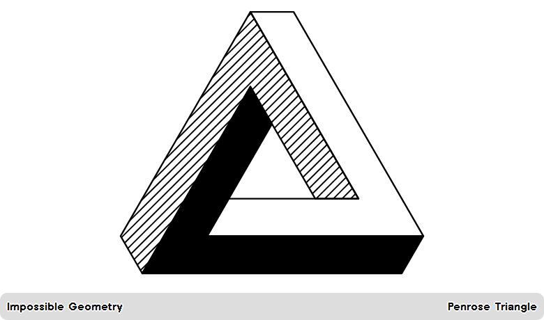

# Impossible Geometry

A minimal geometric art plugin for [TRMNL](https://trmnl.com/): one precisely constructed Penrose triangle with white, black and hatched faces.



The artwork is embedded SVG. It needs no image hosting, polling API, credentials or saved state. The complete triangle is preserved in Full, Half Horizontal, Half Vertical and Quadrant layouts on OG and X. Captions default off; English and German are available.

This is a **single-artwork design prototype**. It does not offer rotation or a collection yet. Physical-device testing is still pending.

## Install

Repository: https://github.com/michaelkurath/Impossible-Geometry

Use `src/settings.yml`, the four layout files, `shared.liquid` and `transform.js` with the existing private plugin (ID 499458), using your normal trmnlp workflow. Shared contains the complete artwork; you do not need to upload the separate SVG asset. A public recipe link will be added after publication.

## Settings

| Setting | Values | Default |
| --- | --- | --- |
| Language | `en`, `de` | `en` |
| Show explanation | `yes`, `no` | `no` |

Settings are trimmed and lowercased. Missing or unsupported language falls back to English; explanations appear only for `yes`, in full and half-vertical layouts. The artwork renders even if transform output is missing.

## Development

```sh
npm install
npx playwright install --with-deps chromium
npm run build:art
npm run check:art
npm test
npm run render
# Optional, with trmnlp installed:
trmnlp serve
```

`scripts/build-art.cjs` defines the geometry once and produces the standalone SVG and generated block in `src/shared.liquid`. Edit the generator rather than either output. The three faces follow an exact 60-degree lattice. Hatch segments are intersected with the shaded face; no pattern IDs can clash across plugin instances.

The fallback renderer uses LiquidJS, Chromium and TRMNL Framework 3.3.1. It checks all four layouts on OG, X landscape and X portrait, both languages, and both caption settings. It validates bounds, footer text overflow and embedded artwork. It does not reproduce physical e-paper rasterization.

[Artwork and source credit](docs/artwork.md) · [Validation](docs/validation.md) · [SVG](assets/artwork/penrose-triangle.svg)
