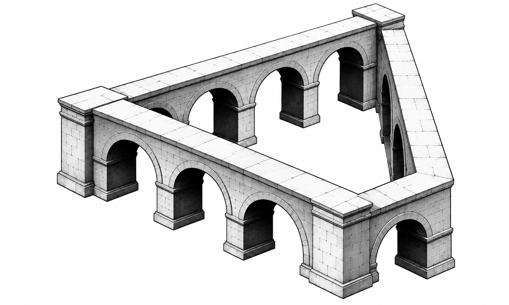

# Impossible Geometry

Original monochrome architectural art for [TRMNL](https://trmnl.com/). **Work in progress: single-artwork visual prototype.**



The Returning Arcade replaces the initial six vector exercises with a full-screen gallery study. It is AI-generated original artwork, not a reproduction of an Escher print. Its architectural depth is promising; the impossible connection still needs a stronger visual pass before release.

## Layouts

Full, Half Horizontal, Half Vertical and Quadrant preserve the complete image. A standard title bar carries the artwork name. Explanations default off. English and German are available. Rotation controls are intentionally absent while there is one artwork.

The framework's image dithering handles monochrome rendering; final appearance must be checked on physical OG and X hardware. Portrait and narrow views retain the composition and consequently have more white space.

## Install and develop

This branch is a design preview. Import `src/settings.yml` and the four Liquid layouts plus `shared.liquid` into the existing private plugin (ID 499458), or use your normal trmnlp workflow. No polling API is required. The PNG is hosted in this repository; rendering requires access to raw.githubusercontent.com. The image URL is pinned to the draft branch until release, so retain that branch until the URL is updated.

Repository: https://github.com/michaelkurath/Impossible-Geometry

A public recipe link will be added when published; none has been assigned yet.

```sh
npm install
npm test
npm run render
# Optional, with trmnlp installed:
trmnlp serve
```

The fallback renderer uses LiquidJS, Chromium and TRMNL Framework 3.3.1. It checks all four layouts on OG, X landscape and X portrait with both languages and caption settings. It checks image loading and element bounds; it does not emulate physical e-paper dithering or prove the artwork's optical illusion.

See [artwork provenance](docs/artwork.md) and [validation](docs/validation.md).
